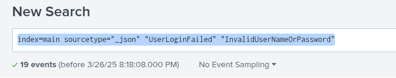

## Log-Analysis-with-Splunk
We ingested data from the "attack_data" repository found on GitHub and used Splunk to analyze the 10 most common types of attacks.

## Technologies used
- Splunk Enterprise
- Source of the logs: https://github.com/splunk/attack_data/tree/master
- Languages: SPL (Splunk Processing Language)

## SPL queries used
  
  # Brute Force:
    

    
